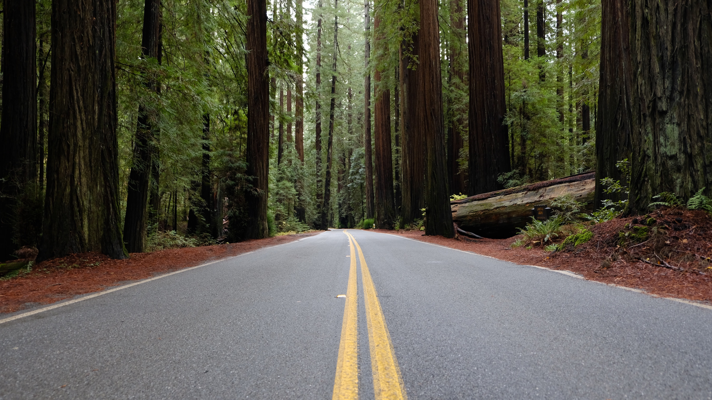

# Predicting California travel trends during Covid-19

### Description:  
This study examines travel trends in the United States, specifically trips taken in the state of California, and aims to predict future trends. The scope of the data covers California trips from January 2019 through October 2020, with the prediction objective focused on the next 6 months for short term planning as well as the next 2 years for longer term planning. California Covid-19 data representing reported cases are also taken into account, offering further insight into travel during the pandemic. This information is helpful for small businesses making hiring decisions during a pandemic and planning to stock up on goods for return customers.

In order to predict the number of trips taken in upcoming months, we explored a variety of methods. Specifically, the technical forecasting approach in this study consists of several time series models, with the ARIMA model producing the best results. However, we have found that it is very difficult to predict the travel trends in California due to the uncertainty surrounding Covid-19 cases and deaths. There are many different inputs that can affect the number of Covid-19 cases and deaths, such as the distribution of a vaccine, mask mandates, attending school in-person, and the willingness of people to adhere to health guidelines. Because of these unknowns, it is a challenge to model future travel trends.

### Files:
* [Presentation Slides](https://speakerdeck.com/corinnemedeiros/predicting-california-travel-trends)
* [Data Prep and Exploratory Data Analysis](https://corinnemedeiros.github.io/Projects/CA-Travel-Trends/CA-Travel-Trends_DataPrep_EDA.html)  

### Libraries:  
* pandas  
* numpy  
* matplotlib
    
### Software:  
* Python
* R
* Jupyter Notebook   

### References:

BTS.gov. (2020, November 9). Trips By Distance. Retrieved from https://data.bts.gov/Research-and-Statistics/Trips-by-Distance/w96p-f2qv  

California ALL. (2020, November 9). Tracking COVID-19 in California. CA.gov. Retrieved from https://covid19.ca.gov/state-dashboard/  

California Open Data. (2020). COVID-19 Cases. Retrieved from https://data.ca.gov/dataset/covid-19-cases/resource/926fd08f-cc91-4828-af38-bd45de97f8c3  

Data.gov. (2020, September 29). Trips By Distance. Bureau of Transportation Statistics. Retrieved from https://catalog.data.gov/dataset/trips-by-distance  

Forecasting: Principles and Practice. (n.d.). Retrieved November 08, 2020, from https://otexts.com/fpp2/arima-r.html  

Prabhakaran, S. (2020, September 17). ARIMA Model - Complete Guide to Time Series Forecasting in Python. Retrieved November 08, 2020, from https://www.machinelearningplus.com/time-series/arima-model-time-series-forecasting-python/  

Singh, D. (2019, July 12). Deepika Singh. Retrieved September 29, 2020, from https://www.pluralsight.com/guides/time-series-forecasting-using-r  

Tourwriter. (2020). The travel industry is resilient: Historical events and how tourism has bounced back. Retrieved from https://www.tourwriter.com/travel-software-blog/covid-19-pt1/  

Presentation template by [SlidesCarnival](http://www.slidescarnival.com/)  

Photographs by [Unsplash](https://unsplash.com/)  

### License
The content of this project itself is licensed under the [Creative Commons Attribution 3.0 Unported license](https://creativecommons.org/licenses/by/3.0/), and the underlying source code used to format and display that content is licensed under the [MIT license](https://github.com/github/choosealicense.com/blob/gh-pages/LICENSE.md).
