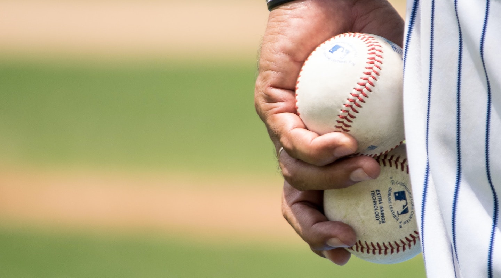

# Improving a Dodgers Marketing Promotion  

  

*Photo by Jose Francisco Morales on Unsplash*

### Description:  
This project analyzes Dodgers Major League Baseball data from 2012 to determine what night would be the best to run a marketing promotion to increase attendance.  

### Files:
* [Data Source: dodgers.csv](https://corinnemedeiros.github.io/Projects/Dodgers-Marketing/dodgers.csv)
* [Exploratory Data Analysis in Python](https://corinnemedeiros.github.io/Projects/Dodgers-Marketing/Dodgers-Marketing_EDA.html)  
* [Modeling in R](https://corinnemedeiros.github.io/Projects/Dodgers-Marketing/Dodgers-Marketing_Modeling.html)  

### Libraries:  
* pandas  
* numpy  
* matplotlib  
* seaborn  
* boot  
* ggm  
* ggplot2  
* Hmisc  
* polycor  
* readxl  
* car  
* QuantPsyc  
* broom
* caTools  

### Software:  
* Python
* Jupyter Notebook  
* R Studio  

### License
The content of this project itself is licensed under the [Creative Commons Attribution 3.0 Unported license](https://creativecommons.org/licenses/by/3.0/), and the underlying source code used to format and display that content is licensed under the [MIT license](https://github.com/github/choosealicense.com/blob/gh-pages/LICENSE.md).
