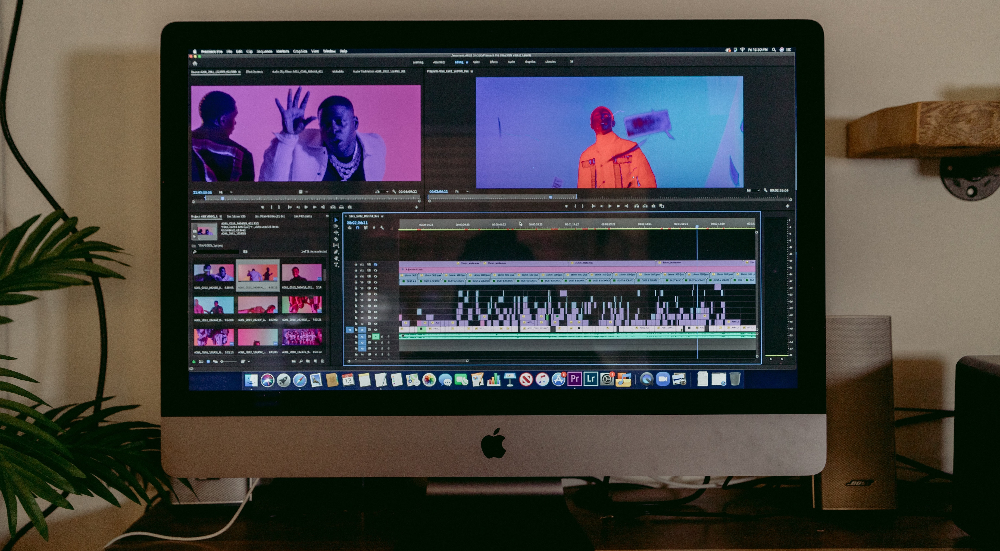

# Analyzing Video Characteristics and Transcoding Time

  

*Photo by Jakob Owens on Unsplash*

### Description:  
This study examines characteristics of videos from YouTube and aims to provide insight on video transcoding trends. The domain these data come from is film post-production, which entails all the steps that take place after shooting a movie and before consumer viewing. Specifically, this project represents the deliverables and distribution aspect of the post-production process; i.e. how a movie gets from the filmmakers’ camera to your personal device. After a video has been edited and color corrected for example, it needs to be converted into the proper format for its intended platform, whether that be broadcast, theatrical, or online streaming.  

Transcoding is the process of converting videos from one format to another (Cardwell, n.d.). Videos differ in frame rates, codecs, durations, size, and color management for instance. Transcoding to different formats involves a considerable amount of time and computer memory usage, so looking at which video metadata are responsible for the time and memory used can help give insight on where to optimize the process. In order to analyze the data, I explored the relationships between video characteristics and transcode time through a variety of visualizations representing variable distributions and correlations.  

### Files: 
* [Report](https://corinnemedeiros.github.io/Projects/Video-Characteristics-Transcoding/Video-Characteristics-Transcoding_Report.pdf)
* [Presentation](https://youtu.be/1Mk7VKnO7Sg)
* [Code](https://corinnemedeiros.github.io/Projects/Video-Characteristics-Transcoding/Video-Characteristics-Transcoding_EDA.html)

### Libraries:  
* pandas  
* numpy  
* matplotlib
* seaborn
* scipy
* yellowbrick
    
### Software:  
* Python
* Jupyter Notebook
* Tableau Prep Builder
* Tableau

### References:

Agrawal, P., Zabrovskiy, A., Ilangovan, A. et al. (2020). FastTTPS: Fast approach for video transcoding time prediction and scheduling for HTTP adaptive streaming videos. Cluster Comput. https://doi.org/10.1007/s10586-020-03207-x  

Cardwell, S. (n.d.). Understanding codecs, proxies, and transcoding. Emerson College Post Production Labs. Retrieved from https://postproduction.emerson.edu/hc/en-us/articles/225933327-Understanding-Codecs-Proxies-and-Transcoding  

Deneke, T. (2015, May 19). Online Video Characteristics and Transcoding Time Dataset. UCI Machine Learning Repository. [https://archive.ics.uci.edu/ml/datasets/Online+Video+Characteristics+and+Transcoding+Time+Dataset]. Irvine, CA: University of California, School of Information and Computer Science.  

Deneke, T., Haile, H., Lafond, S. and Lilius, J. (2014). Video transcoding time prediction for proactive load balancing. 2014 IEEE International Conference on Multimedia and Expo (ICME), pp. 1-6, doi: 10.1109/ICME.2014.6890256. Retrieved from https://ieeexplore.ieee.org/abstract/document/6890256  

FFmpeg developers. (2021, June 13). ffmpeg Documentation. FFmpeg. Retrieved from https://ffmpeg.org/ffmpeg.html  

Kesavaraja, D., & Shenbagavalli, A. (2018). Framework for fast and efficient cloud video transcoding system using intelligent splitter and Hadoop MapReduce. Wireless Personal Communications, 102(3), 2117–2132. Retrieved from https://doi-org.ezproxy.bellevue.edu/10.1007/s11277-018-5501-3  

Li, X., Salehi, M., Joshi, Y., Darwich, M., Landreneau, B., & Bayoumi, M. (2019). Performance Analysis and Modeling of Video Transcoding Using Heterogeneous Cloud Services. IEEE Transactions on Parallel and Distributed Systems, 30, 910-922. Retrieved from http://arxiv.org/pdf/1809.06529  

Maayan, G. D. (2020, December 22). Video optimization: Traditional vs machine learning methods. Towards Data Science. Retrieved from https://towardsdatascience.com/video-optimization-traditional-vs-machine-learning-methods-d910c244a804  

Mozilla. (2021). Web video codec guide. MDN Web Docs. Retrieved from https://developer.mozilla.org/en-US/docs/Web/Media/Formats/Video_codecs  

Ruether, T. (2019, October 16). Video codecs and encoding: Everything you should know (update). Wowza Media Systems. Retrieved from https://www.wowza.com/blog/video-codecs-encoding  

Sagar, R. (2021, April 29). Chips that power your vlogs: the secret behind YouTube’s uninterrupted service. Analytics India Magazine. Retrieved from https://analyticsindiamag.com/chips-that-power-your-vlogs-the-secret-behind-youtubes-uninterrupted-service/  

Strickland, JR. (2020, July 13). How and why transcoding helps the editing process. Videomaker. Retrieved from https://www.videomaker.com/how-to/editing/how-and-why-transcoding-helps-the-editing-process/  

Walton, S. (2012, June 14). Intel Core i7-3720QM: Mobile Ivy Bridge review. TechSpot. Retrieved from https://www.techspot.com/review/535-intel-core-i7-3720qm/  

Wilbert, M. (2021, March 31). Streaming codecs for video and audio: What broadcasters need to know in 2021. Dacast. Retrieved from https://www.dacast.com/blog/codec-basics-for-online-video-audio-and-live-streaming/  

Photographs by [Unsplash](https://unsplash.com/)  

### License
The content of this project itself is licensed under the [Creative Commons Attribution 3.0 Unported license](https://creativecommons.org/licenses/by/3.0/), and the underlying source code used to format and display that content is licensed under the [MIT license](https://github.com/github/choosealicense.com/blob/gh-pages/LICENSE.md).
