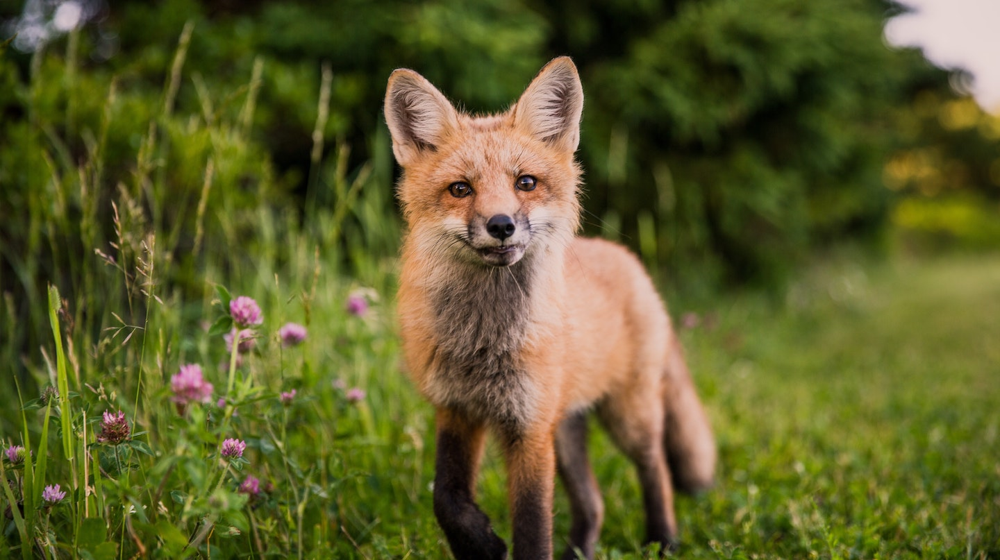

# Analyzing Wildlife Population and Harvest Data    

  

*Photo by Scott Walsh on Unsplash*

### Description:  
This project focuses on groups of endangered and threatened species including mammals, birds, reptiles, and amphibians, with some initial exploration of harvest data by region. My hypothesis explores the relationship between time and endangered or threatened status, as well as relationships between specific groups of species and all species together. The dataset comes from the U.S. Department of Agriculture’s website, provided by the Forest Service Research & Development (FS R&D) on wildlife population and harvest data. It includes data captured from 1955 until 2010. The data extend across a range of assessment areas, including the Pacific Coast, Rocky Mountain, North, and South. Data Source: https://doi.org/10.2737/RDS-2014-0009  

### Files: 
* [Wildlife Population and Harvest Data Analysis](https://corinnemedeiros.github.io/Projects/Wildlife-Population-Harvest/Wildlife-Population-Harvest.html)  
* [Wildlife Population and Harvest Data Presentation](https://speakerdeck.com/corinnemedeiros/wildlife-population-and-harvest-data-exploration-and-analysis)  

### Libraries:  
* thinkstats2  
* thinkplot  
* matplotlib  
* pandas
* scipy  
* numpy  

### Software:    
* Python  
* Jupyter Notebook  

### License
The content of this project itself is licensed under the [Creative Commons Attribution 3.0 Unported license](https://creativecommons.org/licenses/by/3.0/), and the underlying source code used to format and display that content is licensed under the [MIT license](https://github.com/github/choosealicense.com/blob/gh-pages/LICENSE.md).
